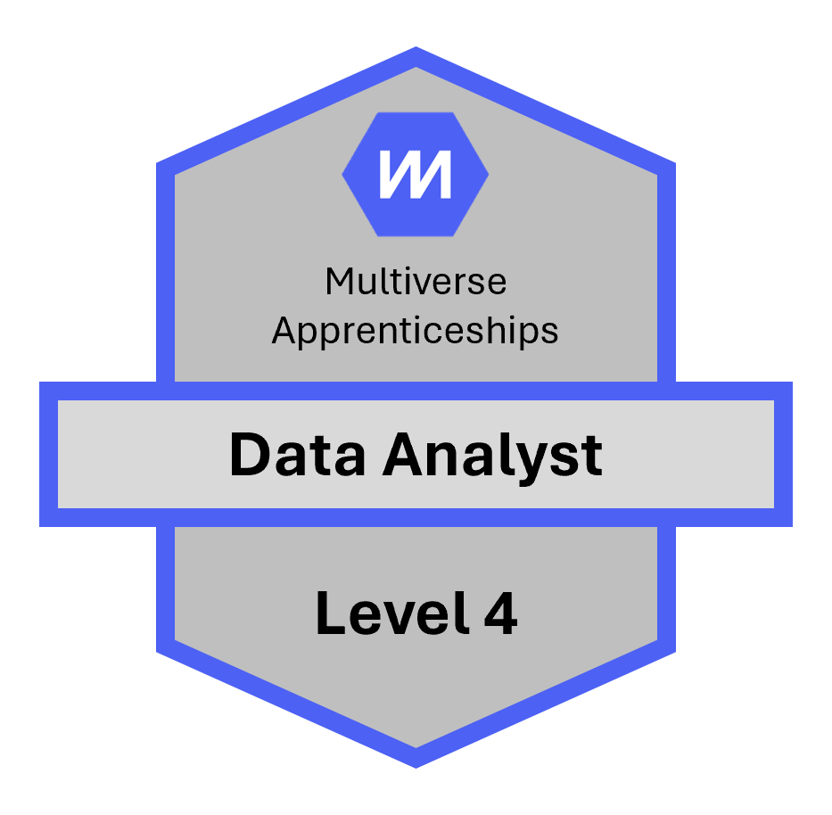
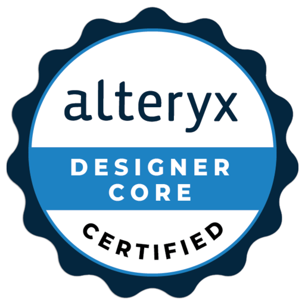

<!DOCTYPE html>
<html lang="en">
  <head>
    <meta charset="UTF-8" />
    <meta name="viewport" content="width=device-width, initial-scale=1.0" />
    <meta
      name="description"
      content="Lewis Whitfield is a Data, AI and Automation solutions engineer helping UK public sector teams turn complex data problems into practical outcomes."
    />
    <title>Lewis Whitfield | Data, AI & Automation</title>
    <link rel="preconnect" href="https://fonts.googleapis.com" />
    <link rel="preconnect" href="https://fonts.gstatic.com" crossorigin />
    <link
      href="https://fonts.googleapis.com/css2?family=Inter:wght@400;500;600;700;800&display=swap"
      rel="stylesheet"
    />
    <link rel="stylesheet" href="styles.css" />
  </head>
  <body>
    <header class="site-header" data-header>
      <a class="brand" href="#home" aria-label="Lewis Whitfield home">
        LW
        Lewis Whitfield
      </a>

      <button class="nav-toggle" type="button" aria-label="Open navigation" aria-expanded="false" data-nav-toggle>
        
        
      </button>

      <nav class="site-nav" data-nav>
        <a href="#about">About</a>
        <a href="#projects">Projects</a>
        <a href="#articles">Articles & Posts</a>
        <a href="#testimonials">Testimonials</a>
        <a href="#honors">Honors & Awards</a>
        <a href="#certifications">Certifications</a>
        <a class="nav-cta" href="#contact">Contact</a>
      </nav>
    </header>

    <main>
      <section class="hero section" id="home">
        

        

          

            
Data, AI & Automation for the UK public sector

            <h1>Turning data complexity into outcomes that matter.</h1>
            

              I help public sector teams move from manual processes and fragmented data to trusted
              analytics, governed AI and automated workflows that improve real decisions.
            

            

              <a class="button button-primary" href="mailto:lewis-whitfield@outlook.com">Get in touch</a>
              <a class="button button-secondary" href="https://www.linkedin.com/in/lewis-whitfield-522902143/" target="_blank" rel="noreferrer">LinkedIn</a>
              <a class="button button-ghost" href="https://github.com/lwhit24" target="_blank" rel="noreferrer">GitHub</a>
            

            

              Public sector
              NHS focus
              Health & government
              Governed AI
            

          

          <aside class="hero-panel reveal" aria-label="Profile summary">
            

              
            

            

              
Current focus

              <h2>UK Public Sector Solutions Engineer at Alteryx</h2>
              

                Designing scalable analytics, automation and AI workflows for health and government,
                with a particular focus on NHS use cases and responsible AI adoption.
              

            

          </aside>
        

      </section>

      <section class="section section-light" id="about">
        

          

            
About

            <h2>Commercially grounded. Technically curious. Outcome obsessed.</h2>
          

          

            

              My path into data started with hands-on analyst work at Abicor Binzel UK, where I saw how
              clearer information could change the quality and speed of decisions. I then moved into
              technology sales at HPE, building commercial discipline while deepening my data capability
              through HPE's Data Academy and a Level 4 Data Analyst apprenticeship with Multiverse.
            

            

              At Methods Analytics, I worked as a Data & AI Consultant advising public and private sector
              organisations on how to apply data to real societal and business problems. Today, as a UK
              Public Sector Solutions Engineer at Alteryx, I bring that mix of strategy, stakeholder
              communication and technical delivery into conversations about automation, governed AI and
              operational improvement.
            

            

              

                <strong>7+</strong>
                years of experience across Data & AI consulting and technology roles
              

              

                <strong>3</strong>
                public sector domains across NHS, central government and policing
              

              

                <strong>Builder</strong>
                of repeatable AI and automation frameworks that move from concept to adoption quickly
              

            

          

        

      </section>

      <section class="section" id="projects">
        

          

            
Projects

            <h2>Applied work across health, government, AI and analytics.</h2>
            

              Publicly visible projects and demos gathered from LinkedIn posts, articles and speaking pages.
            

            <a class="inline-link" href="https://www.linkedin.com/in/lewis-whitfield-522902143/details/projects/" target="_blank" rel="noreferrer">View LinkedIn projects</a>
          

          

            

              <button type="button" data-carousel-prev aria-label="Previous projects">&lsaquo;</button>
              <button type="button" data-carousel-next aria-label="Next projects">&rsaquo;</button>
            

            

              <article class="feature-card">
                
HLD

                

                  Mar 2026 - Present
                  <h3>Agentic High Level Design Automation</h3>
                  
Designed and delivered HLD 2.0, an AI-driven automation initiative that helps Alteryx Sales Engineers create customer High-Level Design architecture deliverables in minutes rather than hours.

                  
Built a ChatGPT/Codex-powered workflow with slide templating, prompt logic, rules, and PowerPoint generation across Alteryx One deployment and cloud architecture scenarios.

                  <a class="card-link" href="https://www.linkedin.com/in/lewis-whitfield-522902143/details/projects/" target="_blank" rel="noreferrer">View on LinkedIn</a>
                

              </article>
              <article class="feature-card">
                
LLM

                

                  Nov 2025 - Mar 2026
                  <h3>Bring Your Own Model to an Alteryx Workflow</h3>
                  
Led development of a BYO-LLM integration framework for Alteryx One, enabling organisations to securely connect privately hosted large language models into enterprise analytics workflows.

                  
Designed and demonstrated an end-to-end architecture using Ollama-hosted open-source models connected to Alteryx GenAI tools through OpenAI-compatible APIs.

                  <a class="card-link" href="https://www.linkedin.com/posts/lewis-whitfield-522902143_ai-llm-alteryx-activity-7450834953451393025-QZLz?utm_source=share&utm_medium=member_desktop&rcm=ACoAACLW7GoBQxwSZSh2J6rv4FEm865j5mD--Xg" target="_blank" rel="noreferrer">View related post</a>
                

              </article>
            

          

        

      </section>

      <section class="section section-light" id="articles">
        

          

            
Articles & Posts

            <h2>Writing and posts on analytics, AI, policing and public sector transformation.</h2>
          

          

            

              <button type="button" data-carousel-prev aria-label="Previous articles">&lsaquo;</button>
              <button type="button" data-carousel-next aria-label="Next articles">&rsaquo;</button>
            

            

              <a class="article-card" href="https://www.linkedin.com/posts/lewis-whitfield-522902143_dashboards-alteryx-ai-activity-7475085863367081984-l5s1?utm_source=share&utm_medium=member_desktop&rcm=ACoAACLW7GoBQxwSZSh2J6rv4FEm865j5mD--Xg" target="_blank" rel="noreferrer">
                
BI
LinkedIn post<h3>Are Dashboards Dead?</h3>
Dashboards are not dead, but they are becoming one interface among many in the analytics experience.

              </a>
              <a class="article-card" href="https://www.linkedin.com/posts/lewis-whitfield-522902143_ai-llm-alteryx-activity-7450834953451393025-QZLz?utm_source=share&utm_medium=member_desktop&rcm=ACoAACLW7GoBQxwSZSh2J6rv4FEm865j5mD--Xg" target="_blank" rel="noreferrer">
                
LLM
LinkedIn post<h3>Bring Your Own LLM</h3>
Thoughts on embedding large and small language models into governed Alteryx workflows.

              </a>
              <a class="article-card" href="https://www.linkedin.com/posts/lewis-whitfield-522902143_standing-in-a-finished-room-you-built-activity-7441525545839849472-if4X?utm_source=share&utm_medium=member_desktop&rcm=ACoAACLW7GoBQxwSZSh2J6rv4FEm865j5mD--Xg" target="_blank" rel="noreferrer">
                
DIY
Project post<h3>Standing in a finished room you built</h3>
A personal project write-up about rebuilding a garage conversion into an office.

              </a>
              <a class="article-card" href="https://www.linkedin.com/posts/lewis-whitfield-522902143_alteryx-ai-nhs-activity-7435005404184567809-OvBz?utm_source=share&utm_medium=member_desktop&rcm=ACoAACLW7GoBQxwSZSh2J6rv4FEm865j5mD--Xg" target="_blank" rel="noreferrer">
                
SAFE
LinkedIn post<h3>Improving NHS AI safety</h3>
How deterministic safety gates, human review and auditability can support safer clinical AI workflows.

              </a>
              <a class="article-card" href="https://www.linkedin.com/posts/lewis-whitfield-522902143_modernising-gp-consultations-with-alteryx-activity-7420515703671128064-TsBi?utm_source=share&utm_medium=member_desktop&rcm=ACoAACLW7GoBQxwSZSh2J6rv4FEm865j5mD--Xg" target="_blank" rel="noreferrer">
                
GP
LinkedIn post<h3>Modernising GP consultations</h3>
A GenAI and Alteryx demonstration for post-consultation admin and healthcare workflow improvement.

              </a>
              <a class="article-card" href="https://www.linkedin.com/posts/lewis-whitfield-522902143_the-train-journeys-back-up-north-from-the-activity-7379809976979968000-tvW2?utm_source=share&utm_medium=member_desktop&rcm=ACoAACLW7GoBQxwSZSh2J6rv4FEm865j5mD--Xg" target="_blank" rel="noreferrer">
                
IDEA
LinkedIn post<h3>Reflections from the journey back north</h3>
A reflective post connecting travel, writing and the practical value of clear analytics thinking.

              </a>
              <a class="article-card" href="https://www.linkedin.com/posts/lewis-whitfield-522902143_tosolveforgood-dataanalytics-policing-activity-7257033730823798784-Mh_O?utm_source=share&utm_medium=member_desktop&rcm=ACoAACLW7GoBQxwSZSh2J6rv4FEm865j5mD--Xg" target="_blank" rel="noreferrer">
                
POL
LinkedIn post<h3>Data analytics in policing</h3>
Public sector analytics thinking focused on policing, harm reduction and better operational decisions.

              </a>
              <a class="article-card" href="https://www.linkedin.com/posts/lewis-whitfield-522902143_microsoft-fabric-data-activity-7239579835214311424-YFeY?utm_source=share&utm_medium=member_desktop&rcm=ACoAACLW7GoBQxwSZSh2J6rv4FEm865j5mD--Xg" target="_blank" rel="noreferrer">
                
MS
LinkedIn post<h3>Microsoft Fabric and data</h3>
Learning and commentary around modern Microsoft data platforms and analytics capability.

              </a>
              <a class="article-card" href="https://www.linkedin.com/posts/lewis-whitfield-522902143_nhs-datasilos-healthcaredata-activity-7224073781797920768-nZsv?utm_source=share&utm_medium=member_desktop&rcm=ACoAACLW7GoBQxwSZSh2J6rv4FEm865j5mD--Xg" target="_blank" rel="noreferrer">
                
NHS
LinkedIn post<h3>NHS data silos</h3>
Why dispersed healthcare data makes insight harder and how better data foundations can help.

              </a>
              <a class="article-card" href="https://www.linkedin.com/posts/lewis-whitfield-522902143_dataanalytics-policing-police-activity-7187101001001095169-F89T?utm_source=share&utm_medium=member_desktop&rcm=ACoAACLW7GoBQxwSZSh2J6rv4FEm865j5mD--Xg" target="_blank" rel="noreferrer">
                
DATA
LinkedIn post<h3>Towards data-driven policing</h3>
Thinking on how data can support policing decisions, visibility and public value.

              </a>
              <a class="article-card" href="https://www.linkedin.com/posts/lewis-whitfield-522902143_microsoft-word-valcri-wp-2017-003-data-activity-7182049400922230784-Um_e?utm_source=share&utm_medium=member_desktop&rcm=ACoAACLW7GoBQxwSZSh2J6rv4FEm865j5mD--Xg" target="_blank" rel="noreferrer">
                
VAL
LinkedIn post<h3>VALCRI and policing research</h3>
A post linking policing analytics research to wider data and decision support questions.

              </a>
              <a class="article-card" href="https://www.linkedin.com/posts/lewis-whitfield-522902143_durhamconstabulary-hartmodel-crimeprevention-activity-7174448435415162880-5wjr?utm_source=share&utm_medium=member_desktop&rcm=ACoAACLW7GoBQxwSZSh2J6rv4FEm865j5mD--Xg" target="_blank" rel="noreferrer">
                
HART
LinkedIn post<h3>HART model and crime prevention</h3>
Commentary around Durham Constabulary, risk modelling and responsible crime prevention analytics.

              </a>
              <a class="article-card" href="https://www.linkedin.com/posts/lewis-whitfield-522902143_today-marks-the-first-day-of-my-latest-stretch-activity-7171909509928468482-UqTc?utm_source=share&utm_medium=member_desktop&rcm=ACoAACLW7GoBQxwSZSh2J6rv4FEm865j5mD--Xg" target="_blank" rel="noreferrer">
                
NEXT
LinkedIn post<h3>First day of the latest stretch</h3>
A career update marking the next phase of growth in data, analytics and public sector work.

              </a>
              <a class="article-card" href="https://www.linkedin.com/posts/lewis-whitfield-522902143_data-dataanalytics-datascience-activity-7031644333455888384-l9vI?utm_source=share&utm_medium=member_desktop&rcm=ACoAACLW7GoBQxwSZSh2J6rv4FEm865j5mD--Xg" target="_blank" rel="noreferrer">
                
DS
LinkedIn post<h3>Data analytics and data science</h3>
Early public writing on the data journey, analytics skills and practical learning.

              </a>
              <a class="article-card" href="https://www.linkedin.com/posts/lewis-whitfield-522902143_data-bigdata-datascience-activity-6811349058804858881-oVsa?utm_source=share&utm_medium=member_desktop&rcm=ACoAACLW7GoBQxwSZSh2J6rv4FEm865j5mD--Xg" target="_blank" rel="noreferrer">
                
BIG
LinkedIn post<h3>Data, big data and data science</h3>
An early post capturing the foundations of a growing interest in data and large-scale analytics.

              </a>
            

          

        

      </section>

      <section class="section" id="testimonials">
        

          

            
Testimonials

            <h2>Trusted by colleagues, leaders and customers.</h2>
          

          

            

              <button type="button" data-carousel-prev aria-label="Previous testimonials">&lsaquo;</button>
              <button type="button" data-carousel-next aria-label="Next testimonials">&rsaquo;</button>
            

            

              <figure class="testimonial-card">
                <blockquote>Lewis stands out not only for his technical capability, but for how quickly he established himself as a trusted advisor and leader. He blends technical depth, creative problem solving and clear communication into compelling customer conversations and actionable designs.</blockquote>
                <figcaption><strong>Joe Marco</strong>Shaping the Future of Analytics & AI Worldwide</figcaption>
              </figure>
              <figure class="testimonial-card">
                <blockquote>Lewis has the most incredible ability to translate technology solutions into customer specific language. He cares deeply about supporting his public sector clients and connecting technology to best value and improved services.</blockquote>
                <figcaption><strong>Paul Atkins</strong>Vice President, UKIMEA Storage & Data Services</figcaption>
              </figure>
              <figure class="testimonial-card">
                <blockquote>Lewis is a phenomenal person to work with and someone who always goes above and beyond. Whether giving individual advice, leading campaigns or managing complex matters, he always seems to find a way.</blockquote>
                <figcaption><strong>Kieran Wilton</strong>Vertical Lead for Police, HPE</figcaption>
              </figure>
              <figure class="testimonial-card">
                <blockquote>Lewis excelled at every task put before him. Whether working alone or as part of a team, his dedication, enthusiasm and knowledge impressed us greatly.</blockquote>
                <figcaption><strong>Steve Hallows</strong>Managing Director, Abicor Binzel</figcaption>
              </figure>
              <figure class="testimonial-card">
                <blockquote>He balances a keen eye for detail with a natural ability to converse with customers on a more strategic level. His calm yet confident manner never fails to impress.</blockquote>
                <figcaption><strong>Callum Yates</strong>Solution Architect, HPE</figcaption>
              </figure>
            

          

        

      </section>

      <section class="section section-light" id="honors">
        

          

            
Honors & Awards

            <h2>Recognition for demos, customer storytelling and public sector contribution.</h2>
            <a class="inline-link dark" href="https://www.linkedin.com/in/lewis-whitfield-522902143/details/honors/" target="_blank" rel="noreferrer">View LinkedIn honors</a>
          

          

            

              <button type="button" data-carousel-prev aria-label="Previous honors">&lsaquo;</button>
              <button type="button" data-carousel-next aria-label="Next honors">&rsaquo;</button>
            

            

              <article class="honor-card">
                Alteryx - Mar 2026
                <h3>AI Hackathon with Google - Winner</h3>
                
Achieved first place in the Alteryx, Google and The Information Lab SE AI Hackathon by developing an AI-powered healthcare solution using Alteryx and Google Cloud Platform.

                
The solution used Alteryx workflows orchestrated via the Alteryx MCP Server and invoked through a Gemini Enterprise agent to help clinicians query patient history through natural language.

              </article>
              <article class="honor-card">
                Alteryx - Jan 2026
                <h3>SE Builder Contest - Intl 2nd Place</h3>
                
Rewarded with 2nd place at an international level in the Alteryx SE Builder Contest, presented at the global Revenue Kick Off in Atlanta.

              </article>
              <article class="honor-card">
                HPE - Dec 2024
                <h3>HPE New Logo Legend</h3>
                
Awarded the New Logo Legend award in FY24 Q1 for securing multiple strategic wins with new Police Forces digital forensics departments.

              </article>
              <article class="honor-card">
                HPE - Aug 2023
                <h3>HPE Cool Collaborator</h3>
                
Awarded at HPE's annual Storage Bootcamp in 2023 for work with partner organisations including Zerto and Veeam.

              </article>
              <article class="honor-card">
                HPE - Oct 2022
                <h3>UKIMEA Rising Star of the Year</h3>
                
Awarded FY22 UKIMEA Rising Star of the Year for innovative work in the UK Public Sector space, including Presidents Club recognition in Hawaii.

              </article>
              <article class="honor-card">
                HPE - Mar 2022
                <h3>HPE Inside Sales Signature Deal of the Quarter</h3>
                
Awarded by the CSO of HPE for securing the first-ever HPE GreenLake win in the NHS sector.

              </article>
              <article class="honor-card">
                HPE - Jul 2018
                <h3>Top Talent Intern Award</h3>
                
Awarded the Top Talent Intern Award by HPE for outstanding contributions during the 2017/18 placement year.

              </article>
            

          

        

      </section>

      <section class="section section-light" id="certifications">
        

          

            
Certifications

            <h2>Validated capability across analytics, cloud and automation.</h2>
          

          

            

              <button type="button" data-carousel-prev aria-label="Previous certifications">&lsaquo;</button>
              <button type="button" data-carousel-next aria-label="Next certifications">&rsaquo;</button>
            

            

              <article class="cert-card">
                
                
<h3>Multiverse Data Analyst Level 4 Apprenticeship</h3>
Achieved Winter 2023

              </article>
              <article class="cert-card">
                
                
<h3>Azure Data Fundamentals DP-900</h3>
Achieved August 2024

              </article>
              <article class="cert-card">
                
                
<h3>Azure Fundamentals AZ-900</h3>
Achieved January 2025

              </article>
              <article class="cert-card">
                
                
<h3>Alteryx Designer Core</h3>
Achieved September 2025

              </article>
            

          

        

      </section>

      <section class="section contact-section" id="contact">
        

          

            
Contact

            <h2>Let's talk about data problems worth solving.</h2>
            

              For portfolio conversations, collaboration opportunities or data and AI discussions, the
              quickest route is email or LinkedIn.
            

          

          

            <a href="mailto:lewis-whitfield@outlook.com">Email<strong>lewis-whitfield@outlook.com</strong></a>
            <a href="https://www.linkedin.com/in/lewis-whitfield-522902143/" target="_blank" rel="noreferrer">LinkedIn<strong>Connect with Lewis</strong></a>
            <a href="https://github.com/lwhit24" target="_blank" rel="noreferrer">GitHub<strong>View projects</strong></a>
          

        

      </section>
    </main>

    <footer class="site-footer">
      

        
Designed and built for GitHub Pages.

        <a href="#home">Back to top</a>
      

    </footer>

    
  </body>
</html>
